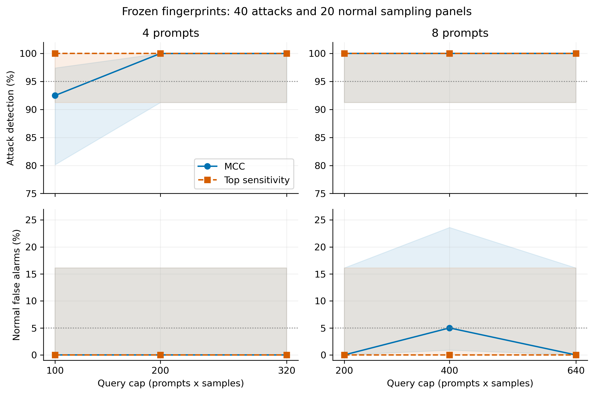
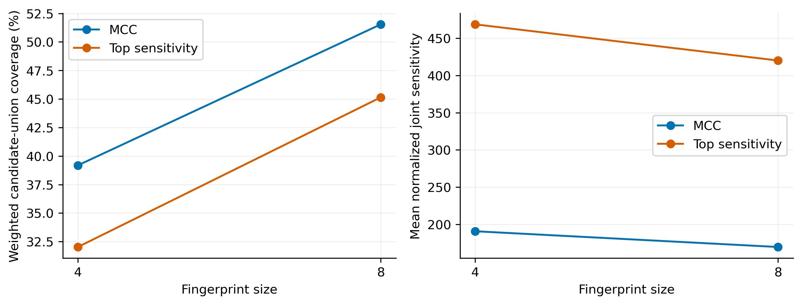

# 7B敏感提示词指纹：MCC与敏感度排序检测对照

## 主要结果

本轮没有观察到MCC相对敏感度排序的检测优势。在最低预算4条提示词×每条25次查询（100次查询）下，敏感度排序检出40/40攻击，MCC检出37/40；二者均无正常误报。其余五个预算配置中两者攻击检出均为40/40。MCC的8×50配置出现1/20正常误报，其余配置均为0/20。

MCC提高了本实验定义下的组件覆盖率，但覆盖增益没有转化为本轮检测增益。4×25的配对McNemar未校正p=0.25，不能据此断言总体上排序显著优于MCC，也不能声称两种方法已被证明等效。

## 固定设计与数据

Qwen2.5-7B-Instruct，BF16、eager attention。原400条人工合成母池中100条用于校准；待优化池经用户预算修订从300→100→80。最终80条四类各20、20个子任务各4，固定随机种子嵌套抽样，不按得分挑选。61条接受改写且文本唯一，19条未接受；另28条额外历史搜索仅归档。接受改写是代理目标改善，不保证语义不变或独立检测成功。

共同候选池统一计算7类微观分数、5种修改各5变体的JS均值及归一化联合得分；微观权重9.619061603348785。MCC按激活组件加权覆盖贪心选择，Top按联合敏感度排序；各分支4条是8条的前缀，跨分支总共15条唯一提示词。选择在测试训练、采样前冻结。

检测使用首token分布的RESF启发式协议：实际temperature=0.7、top-k=50、top-p=0.9；正常参考温度网格0.5/0.7/0.9，MC每个网格成员、每个n为10000次。面板alpha=0.05，E规则份额0.2，P规则份额0.8，并按提示词数量分配。每个n单独终点判定，不声称12配置整体同时控制误报。

40个新攻击端点=高斯4强度（0.001/0.0025/0.004/0.006）×5种子 + LoRA4步数（5/10/20/40）×5种子。测试LoRA使用独立的冻结32条合成常识训练数据；20个正常面板来自同一正常模型的独立采样，不是20个不同模型。全部端点各15条×80次，共72000条新响应；n25/50是80响应前缀，共享提示词共享采样。

## 12组完整结果

|选择方法|指纹条数m|每条查询n|查询预算|攻击检出|检测率|正常误报|误报率|
|---|---:|---:|---:|---:|---:|---:|---:|
|MCC|4|25|100|37/40|92.5%|0/20|0.0%|
|Top sensitivity|4|25|100|40/40|100.0%|0/20|0.0%|
|MCC|4|50|200|40/40|100.0%|0/20|0.0%|
|Top sensitivity|4|50|200|40/40|100.0%|0/20|0.0%|
|MCC|4|80|320|40/40|100.0%|0/20|0.0%|
|Top sensitivity|4|80|320|40/40|100.0%|0/20|0.0%|
|MCC|8|25|200|40/40|100.0%|0/20|0.0%|
|Top sensitivity|8|25|200|40/40|100.0%|0/20|0.0%|
|MCC|8|50|400|40/40|100.0%|1/20|5.0%|
|Top sensitivity|8|50|400|40/40|100.0%|0/20|0.0%|
|MCC|8|80|640|40/40|100.0%|0/20|0.0%|
|Top sensitivity|8|80|640|40/40|100.0%|0/20|0.0%|

查询预算是单端点检验的m×n上限；不包括生成、校准、MCC特征提取或测试模型训练成本。

按预定样本目标“检出≥38/40且误报≤1/20”，本次测试网格中Top的最低达标预算为100（4×25）；MCC为200（4×50，另8×25也为200）。这只是本次测试上的描述性最低预算，不是另有独立验证集确认的最终部署配置。

## 分层与配对结果

MCC在4×25时漏检3个高斯端点，分别来自0.001、0.0025、0.004，每层4/5；0.006为5/5。该配置的20个LoRA均检出。Top在该配置及其他配置的所有8个攻击分层均为5/5。每层只有5个实例，不能据5/5认定普遍可靠。

|m|n|MCC−Top检测率差|仅MCC命中|仅Top命中|配对bootstrap 95%区间|McNemar p（未校正）|
|---:|---:|---:|---:|---:|---|---:|
|4|25|-7.5个百分点|0|3|[-15.0, 0.0]个百分点|0.25|
|4|50|0.0个百分点|0|0|[0.0, 0.0]个百分点|1|
|4|80|0.0个百分点|0|0|[0.0, 0.0]个百分点|1|
|8|25|0.0个百分点|0|0|[0.0, 0.0]个百分点|1|
|8|50|0.0个百分点|0|0|[0.0, 0.0]个百分点|1|
|8|80|0.0个百分点|0|0|[0.0, 0.0]个百分点|1|

分层配对bootstrap只在当前8个攻击分层的5个种子内重采样，不包含提示词生成、校准与模型选择的不确定性；零宽度区间仅说明当前观察配对差均为零。

## 覆盖率与科研解释

|分支|规模|候选组件并集加权覆盖率|平均联合敏感度|
|---|---:|---:|---:|
|MCC|4|39.19%|190.660|
|MCC|8|51.54%|169.499|
|Top sensitivity|4|32.03%|468.798|
|Top sensitivity|8|45.15%|420.148|

MCC覆盖率更高，而Top平均敏感度更高。这说明两个选择目标确实产生了不同面板；本轮低预算检测更偏向高敏感度。组件覆盖率分母只是61个候选激活组件的并集，不能解释为模型全部参数或能力的覆盖率。

本轮可以支持：冻结的敏感度排序指纹在当前7B、已知攻击家族的新实例上表现较好；尚不能支持MCC选择具有额外检测价值。本轮没有同源普通提示词指纹分支，所以也不能单独证明敏感提示词优化相对普通提示词的收益。

40/40的Wilson 95%区间约为91.24%—100%；0/20正常误报的区间约为0—16.11%。因此观察达标不等于总体检测率已证明≥95%、总体误报率已证明≤5%。当前证据不外推到未知攻击家族、其他模型规模、其他解码条件或所有自然语言提示词。

## 图与核验

阴影为逐配置Wilson 95%区间；曲线点有重叠。误报面板纵轴包含区间上界，避免把0/20画成确定无误报。

本地独立审计PASS：归档2855文件、校准依赖6545文件；80来源、61候选、1525宏观记录、4指纹、20测试适配器、72000响应、720面板判定、12配置。独立复算评分、贪心最大增益、参考MC缓存及全部E/P告警；未在本地GPU重算原始logits和激活特征。

结果原始数据：detection80_backup/runs/fingerprint-7b-mcc-vs-top-v1；完整性报告：DETECTION80_LOCAL_AUDIT.json；机器可读汇总：detection80_results.csv；曲线同时提供PDF与PNG。

完整归档SHA256：`7d7b158316a0b8918579a09b89b735bb0f2c5ec60982c0331bd26d866c9cd996`。服务器关机状态另见DETECTION_SHUTDOWN_RESULT.json。
