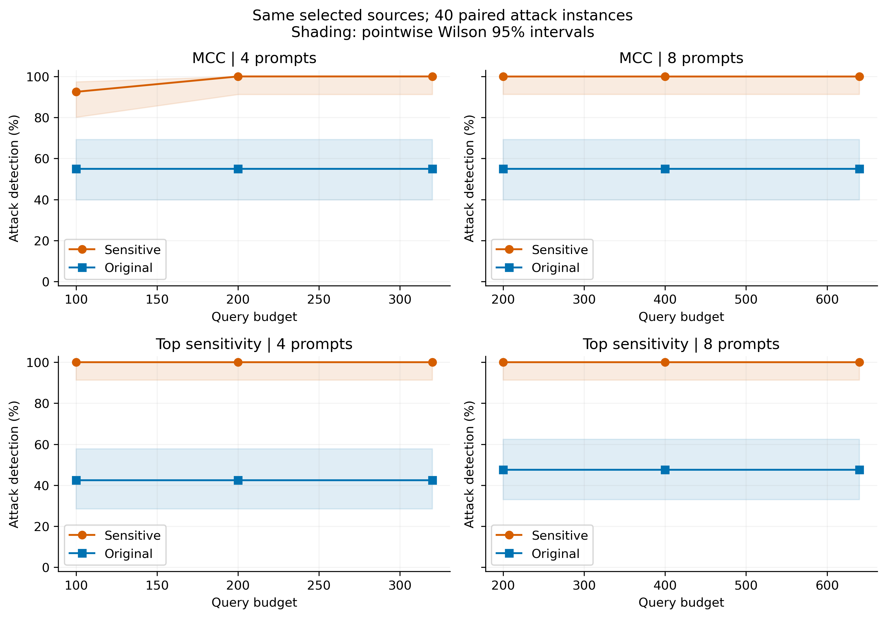

# 7B敏感指纹与同来源普通原文的检测对照

## 实验范围

固定上一轮MCC与Top敏感度排序各4/8条指纹，将15条入选敏感提示词逐条替换为优化前的同来源原文。没有重新生成、排名或运行MCC；相同40个攻击端点、20个正常采样面板、每条25/50/80次，所有检测协议一致。原文有自己的参考分布及MC校准。

模型、软件和20个LoRA适配器身份核验通过；15条敏感参考重新计算通过严格复用门槛。敏感侧复用旧72000响应；普通侧独立新种子72000响应。正常20面板来自一个正常模型的重复采样。

这是看到此前结果后补充的同来源诊断，回答最终入选来源的文本改写收益，不能替代普通池独立选择基线或新的独立确认实验。

## 检测与误报

|方法|条数|每条次数|预算|敏感检出/40|原文检出/40|敏感误报/20|原文误报/20|检测率差（百分点）|
|---|---:|---:|---:|---:|---:|---:|---:|---:|
|mcc|4|25|100|37|22|0|0|37.5|
|top_sensitivity|4|25|100|40|17|0|0|57.5|
|mcc|4|50|200|40|22|0|0|45.0|
|top_sensitivity|4|50|200|40|17|0|0|57.5|
|mcc|4|80|320|40|22|0|0|45.0|
|top_sensitivity|4|80|320|40|17|0|0|57.5|
|mcc|8|25|200|40|22|0|0|45.0|
|top_sensitivity|8|25|200|40|19|0|0|52.5|
|mcc|8|50|400|40|22|1|0|45.0|
|top_sensitivity|8|50|400|40|19|0|0|52.5|
|mcc|8|80|640|40|22|0|0|45.0|
|top_sensitivity|8|80|640|40|19|0|0|52.5|

## 配对不确定性

|方法|m|n|仅敏感命中|仅原文命中|差值95%区间（百分点）|McNemar未校正p|
|---|---:|---:|---:|---:|---|---:|
|mcc|4|25|15|0|[27.5, 45.0]|6.1035e-05|
|top_sensitivity|4|25|23|0|[50.0, 65.0]|2.3842e-07|
|mcc|4|50|18|0|[40.0, 50.0]|7.6294e-06|
|top_sensitivity|4|50|23|0|[50.0, 65.0]|2.3842e-07|
|mcc|4|80|18|0|[40.0, 50.0]|7.6294e-06|
|top_sensitivity|4|80|23|0|[47.5, 65.0]|2.3842e-07|
|mcc|8|25|18|0|[40.0, 50.0]|7.6294e-06|
|top_sensitivity|8|25|21|0|[42.5, 60.0]|9.5367e-07|
|mcc|8|50|18|0|[40.0, 50.0]|7.6294e-06|
|top_sensitivity|8|50|21|0|[44.9, 60.0]|9.5367e-07|
|mcc|8|80|18|0|[40.0, 50.0]|7.6294e-06|
|top_sensitivity|8|80|21|0|[42.5, 60.0]|9.5367e-07|

配对bootstrap按攻击类型×强度在每层5个种子中重采样2000次，不包含生成或选择的不确定性；区间为逐配置、未进行多重比较校正。零宽度区间不代表总体差异确定为零。

## 结果解读

在最低预算100次查询时，mcc敏感侧检出37/40，普通原文检出22/40，观察差值为37.5个百分点。是否存在可推广的优势还应结合上述区间和误报率，不能仅凭观察比例断言。
在最低预算100次查询时，top_sensitivity敏感侧检出40/40，普通原文检出17/40，观察差值为57.5个百分点。是否存在可推广的优势还应结合上述区间和误报率，不能仅凭观察比例断言。

本对照只评估已被选中来源的改写效果；不证明整个敏感生成流程优于从全部普通池精心选出的指纹。攻击家族已知且当前端点此前已经测过，不能称为独立确认。40/40也不等于总体检测率被证明100%。

## 分层及单条提示词

完整8个类型/强度分层见paired_original_strata.csv；15条来源的单条命中统计见paired_original_single.csv。单条命中采用m=8的同一多重检验阈值，仅作为贡献诊断。

完整性：PAIRED_ORIGINAL_LOCAL_AUDIT.json为PASS；归档及父实验依赖全部哈希通过，15对来源、参考复用、MC、72000响应、720判定及12配置独立重算核验通过。
