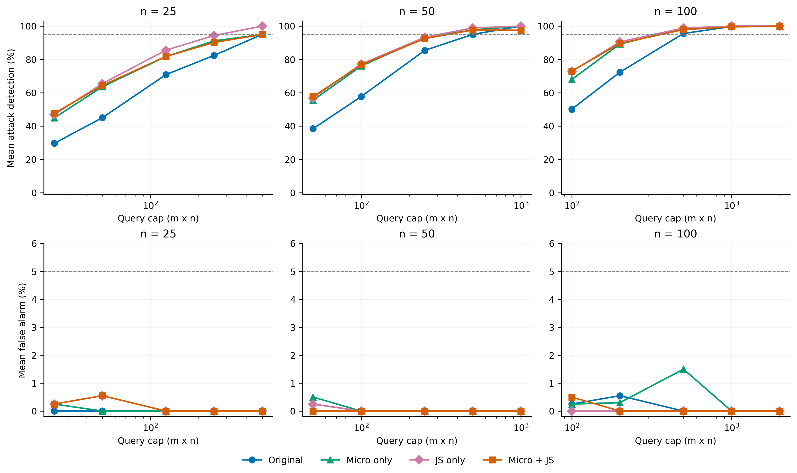
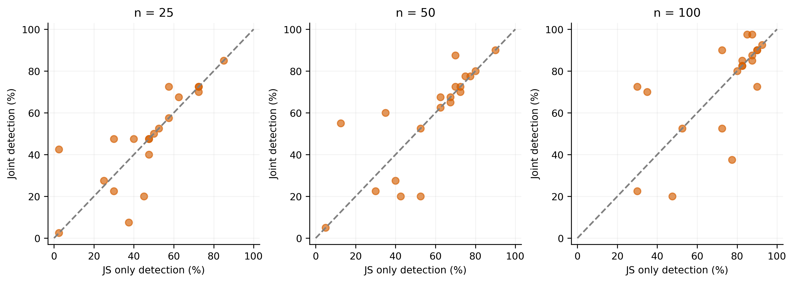

# 微观与JS宏观四组消融实验结果

本报告对应 generation-ablation-v1。所有数字取自已冻结结果，并在本地通过逐响应、逐判定和逐面板复算。当前没有MCC选择；独立开发集排序仅为补充分析。

## 核心结论

本轮没有观察到微观＋JS联合优化相对仅JS宏观优化的稳定额外收益，不足以支持双层结构的必要性。三个采样预算下，两者单提示词平均检出率仅相差0.75、0.75和0.25个百分点；100次时20条来源中联合改善6条、持平8条、退化6条。接近不等于已证明统计等效。

微观目标并非完全无效：100次时仅微观平均检出率68.00%，原文50.125%；仅JS为72.75%，联合73.00%。但是微观单独有效，与它在JS之上具有增量贡献，是两个不同的问题。

同来源2条×100次面板中，仅JS平均检出率90.575%，联合89.575%，均无观测误报；联合达标子集比例42%，仅JS40%。平均检出率与达标比例方向不一致，不能选择性只报告有利指标。完整20条面板中，仅JS在25/50/100次都检出40/40，联合依次为38/40、39/40、40/40，均为0/20误报。

独立开发排序后，主标准的观测最低预算为原文200、仅微观125、仅JS250、联合200；严格全检出零误报标准为原文200、仅微观1000、仅JS500、联合500。本轮联合没有比普通排序更省预算，且不能将排序优势解释为生成机制优势。此前实验的严格预算节省没有在本轮重新生成与新采样下复现，不能继续当作稳定结论。

研究判断：应将“JS优化提高平均探针质量”与“微观组件具有不可替代贡献”分开。本轮支持前者的样本内效果，但尚不支持后者。后续可以把仅JS作为更简洁的候选基线，若保留微观则需要解释其作用条件；本次未启动新实验，也未依据测试结果重新筛选提示词。

## 逐来源主分析

每条原文分别对应三种优化结果；不接受的优化保留原文并纳入分析。下表是20条来源等权平均的单提示词检测率，括号内为平均误报率。每来源对应40个攻击端点及20个正常采样面板。

| 方法 | n=25 | n=50 | n=100 |
|---|---:|---:|---:|
| 原始 | 29.625%（0.000%） | 38.375%（0.250%） | 50.125%（0.250%） |
| 仅微观 | 44.875%（0.250%） | 55.500%（0.500%） | 68.000%（0.250%） |
| 仅JS宏观 | 46.875%（0.250%） | 56.875%（0.250%） | 72.750%（0.000%） |
| 微观＋JS | 47.625%（0.250%） | 57.625%（0.000%） | 73.000%（0.500%） |

## 核心对比：联合优化相对仅JS宏观

| 每条查询数 | 检测率平均差（百分点） | 改善/持平/退化来源数 | 误报率平均差（百分点） |
|---:|---:|---|---:|
| 25 | +0.750 | 6/9/5 | +0.000 |
| 50 | +0.750 | 6/8/6 | -0.250 |
| 100 | +0.250 | 6/8/6 | +0.500 |

以上是同来源的观测差异，不是800个独立模型上的统计结论。未预设联合必优，也不能把持平直接当作等效证明。

## 同来源面板预算矩阵

四组使用相同来源子集：m=1枚举20个来源；m=2/5/10各100个固定子集；m=20一个完整面板。下表依次报告平均检测率、平均误报率、满足检测率≥95%且误报≤5%的子集比例。重叠子集不是独立重复。

| m | n | 方法 | 检测率 | 误报率 | 达标子集比例 |
|---:|---:|---|---:|---:|---:|
| 1 | 25 | 原始 | 29.625% | 0.000% | 0.0% |
| 1 | 25 | 仅微观 | 44.875% | 0.250% | 0.0% |
| 1 | 25 | 仅JS宏观 | 46.875% | 0.250% | 0.0% |
| 1 | 25 | 微观＋JS | 47.625% | 0.250% | 0.0% |
| 1 | 50 | 原始 | 38.375% | 0.250% | 0.0% |
| 1 | 50 | 仅微观 | 55.500% | 0.500% | 0.0% |
| 1 | 50 | 仅JS宏观 | 56.875% | 0.250% | 0.0% |
| 1 | 50 | 微观＋JS | 57.625% | 0.000% | 0.0% |
| 1 | 100 | 原始 | 50.125% | 0.250% | 0.0% |
| 1 | 100 | 仅微观 | 68.000% | 0.250% | 5.0% |
| 1 | 100 | 仅JS宏观 | 72.750% | 0.000% | 0.0% |
| 1 | 100 | 微观＋JS | 73.000% | 0.500% | 10.0% |
| 2 | 25 | 原始 | 45.025% | 0.000% | 0.0% |
| 2 | 25 | 仅微观 | 63.600% | 0.000% | 0.0% |
| 2 | 25 | 仅JS宏观 | 65.475% | 0.550% | 0.0% |
| 2 | 25 | 微观＋JS | 64.350% | 0.550% | 0.0% |
| 2 | 50 | 原始 | 57.700% | 0.000% | 1.0% |
| 2 | 50 | 仅微观 | 76.025% | 0.000% | 3.0% |
| 2 | 50 | 仅JS宏观 | 77.175% | 0.000% | 7.0% |
| 2 | 50 | 微观＋JS | 76.700% | 0.000% | 8.0% |
| 2 | 100 | 原始 | 72.325% | 0.550% | 18.0% |
| 2 | 100 | 仅微观 | 89.225% | 0.300% | 38.0% |
| 2 | 100 | 仅JS宏观 | 90.575% | 0.000% | 40.0% |
| 2 | 100 | 微观＋JS | 89.575% | 0.000% | 42.0% |
| 5 | 25 | 原始 | 70.875% | 0.000% | 2.0% |
| 5 | 25 | 仅微观 | 81.725% | 0.000% | 1.0% |
| 5 | 25 | 仅JS宏观 | 85.550% | 0.000% | 14.0% |
| 5 | 25 | 微观＋JS | 81.825% | 0.000% | 7.0% |
| 5 | 50 | 原始 | 85.425% | 0.000% | 30.0% |
| 5 | 50 | 仅微观 | 93.000% | 0.000% | 54.0% |
| 5 | 50 | 仅JS宏观 | 93.300% | 0.000% | 57.0% |
| 5 | 50 | 微观＋JS | 92.500% | 0.000% | 55.0% |
| 5 | 100 | 原始 | 95.575% | 0.000% | 77.0% |
| 5 | 100 | 仅微观 | 98.575% | 1.500% | 95.0% |
| 5 | 100 | 仅JS宏观 | 98.850% | 0.000% | 97.0% |
| 5 | 100 | 微观＋JS | 97.900% | 0.000% | 91.0% |
| 10 | 25 | 原始 | 82.425% | 0.000% | 3.0% |
| 10 | 25 | 仅微观 | 91.125% | 0.000% | 27.0% |
| 10 | 25 | 仅JS宏观 | 94.350% | 0.000% | 61.0% |
| 10 | 25 | 微观＋JS | 90.175% | 0.000% | 16.0% |
| 10 | 50 | 原始 | 95.050% | 0.000% | 70.0% |
| 10 | 50 | 仅微观 | 97.700% | 0.000% | 96.0% |
| 10 | 50 | 仅JS宏观 | 98.900% | 0.000% | 99.0% |
| 10 | 50 | 微观＋JS | 97.675% | 0.000% | 89.0% |
| 10 | 100 | 原始 | 99.750% | 0.000% | 100.0% |
| 10 | 100 | 仅微观 | 99.950% | 0.000% | 100.0% |
| 10 | 100 | 仅JS宏观 | 99.975% | 0.000% | 100.0% |
| 10 | 100 | 微观＋JS | 99.525% | 0.000% | 100.0% |
| 20 | 25 | 原始 | 95.000% | 0.000% | 100.0% |
| 20 | 25 | 仅微观 | 95.000% | 0.000% | 100.0% |
| 20 | 25 | 仅JS宏观 | 100.000% | 0.000% | 100.0% |
| 20 | 25 | 微观＋JS | 95.000% | 0.000% | 100.0% |
| 20 | 50 | 原始 | 100.000% | 0.000% | 100.0% |
| 20 | 50 | 仅微观 | 100.000% | 0.000% | 100.0% |
| 20 | 50 | 仅JS宏观 | 100.000% | 0.000% | 100.0% |
| 20 | 50 | 微观＋JS | 97.500% | 0.000% | 100.0% |
| 20 | 100 | 原始 | 100.000% | 0.000% | 100.0% |
| 20 | 100 | 仅微观 | 100.000% | 0.000% | 100.0% |
| 20 | 100 | 仅JS宏观 | 100.000% | 0.000% | 100.0% |
| 20 | 100 | 微观＋JS | 100.000% | 0.000% | 100.0% |

## 开发排序补充分析

各组独立按开发攻击检测表现排序，排名在正式采样前冻结。下表是测试矩阵中的观测最低预算，不代表独立确认的最优配置。

| 方法 | ≥38/40检出且≤1/20误报 | 40/40检出且0/20误报 |
|---|---|---|
| 原始 | 2×100=200；检出40/40，误报0/20 | 2×100=200；检出40/40，误报0/20 |
| 仅微观 | 5×25=125；检出38/40，误报0/20 | 10×100=1000；检出40/40，误报0/20 |
| 仅JS宏观 | 5×50=250；检出38/40，误报0/20 | 5×100=500；检出40/40，误报0/20 |
| 微观＋JS | 2×100=200；检出39/40，误报0/20 | 5×100=500；检出40/40，误报0/20 |

## 各攻击强度：完整20条面板

| 方法 | n | 类型/强度 | 检出 |
|---|---:|---|---:|
| 原始 | 25 | gaussian_noise:0.001 | 5/5 |
| 原始 | 25 | gaussian_noise:0.0025 | 5/5 |
| 原始 | 25 | gaussian_noise:0.004 | 5/5 |
| 原始 | 25 | gaussian_noise:0.006 | 5/5 |
| 原始 | 25 | finetuning:5 | 3/5 |
| 原始 | 25 | finetuning:10 | 5/5 |
| 原始 | 25 | finetuning:20 | 5/5 |
| 原始 | 25 | finetuning:40 | 5/5 |
| 原始 | 50 | gaussian_noise:0.001 | 5/5 |
| 原始 | 50 | gaussian_noise:0.0025 | 5/5 |
| 原始 | 50 | gaussian_noise:0.004 | 5/5 |
| 原始 | 50 | gaussian_noise:0.006 | 5/5 |
| 原始 | 50 | finetuning:5 | 5/5 |
| 原始 | 50 | finetuning:10 | 5/5 |
| 原始 | 50 | finetuning:20 | 5/5 |
| 原始 | 50 | finetuning:40 | 5/5 |
| 原始 | 100 | gaussian_noise:0.001 | 5/5 |
| 原始 | 100 | gaussian_noise:0.0025 | 5/5 |
| 原始 | 100 | gaussian_noise:0.004 | 5/5 |
| 原始 | 100 | gaussian_noise:0.006 | 5/5 |
| 原始 | 100 | finetuning:5 | 5/5 |
| 原始 | 100 | finetuning:10 | 5/5 |
| 原始 | 100 | finetuning:20 | 5/5 |
| 原始 | 100 | finetuning:40 | 5/5 |
| 仅微观 | 25 | gaussian_noise:0.001 | 4/5 |
| 仅微观 | 25 | gaussian_noise:0.0025 | 5/5 |
| 仅微观 | 25 | gaussian_noise:0.004 | 5/5 |
| 仅微观 | 25 | gaussian_noise:0.006 | 5/5 |
| 仅微观 | 25 | finetuning:5 | 4/5 |
| 仅微观 | 25 | finetuning:10 | 5/5 |
| 仅微观 | 25 | finetuning:20 | 5/5 |
| 仅微观 | 25 | finetuning:40 | 5/5 |
| 仅微观 | 50 | gaussian_noise:0.001 | 5/5 |
| 仅微观 | 50 | gaussian_noise:0.0025 | 5/5 |
| 仅微观 | 50 | gaussian_noise:0.004 | 5/5 |
| 仅微观 | 50 | gaussian_noise:0.006 | 5/5 |
| 仅微观 | 50 | finetuning:5 | 5/5 |
| 仅微观 | 50 | finetuning:10 | 5/5 |
| 仅微观 | 50 | finetuning:20 | 5/5 |
| 仅微观 | 50 | finetuning:40 | 5/5 |
| 仅微观 | 100 | gaussian_noise:0.001 | 5/5 |
| 仅微观 | 100 | gaussian_noise:0.0025 | 5/5 |
| 仅微观 | 100 | gaussian_noise:0.004 | 5/5 |
| 仅微观 | 100 | gaussian_noise:0.006 | 5/5 |
| 仅微观 | 100 | finetuning:5 | 5/5 |
| 仅微观 | 100 | finetuning:10 | 5/5 |
| 仅微观 | 100 | finetuning:20 | 5/5 |
| 仅微观 | 100 | finetuning:40 | 5/5 |
| 仅JS宏观 | 25 | gaussian_noise:0.001 | 5/5 |
| 仅JS宏观 | 25 | gaussian_noise:0.0025 | 5/5 |
| 仅JS宏观 | 25 | gaussian_noise:0.004 | 5/5 |
| 仅JS宏观 | 25 | gaussian_noise:0.006 | 5/5 |
| 仅JS宏观 | 25 | finetuning:5 | 5/5 |
| 仅JS宏观 | 25 | finetuning:10 | 5/5 |
| 仅JS宏观 | 25 | finetuning:20 | 5/5 |
| 仅JS宏观 | 25 | finetuning:40 | 5/5 |
| 仅JS宏观 | 50 | gaussian_noise:0.001 | 5/5 |
| 仅JS宏观 | 50 | gaussian_noise:0.0025 | 5/5 |
| 仅JS宏观 | 50 | gaussian_noise:0.004 | 5/5 |
| 仅JS宏观 | 50 | gaussian_noise:0.006 | 5/5 |
| 仅JS宏观 | 50 | finetuning:5 | 5/5 |
| 仅JS宏观 | 50 | finetuning:10 | 5/5 |
| 仅JS宏观 | 50 | finetuning:20 | 5/5 |
| 仅JS宏观 | 50 | finetuning:40 | 5/5 |
| 仅JS宏观 | 100 | gaussian_noise:0.001 | 5/5 |
| 仅JS宏观 | 100 | gaussian_noise:0.0025 | 5/5 |
| 仅JS宏观 | 100 | gaussian_noise:0.004 | 5/5 |
| 仅JS宏观 | 100 | gaussian_noise:0.006 | 5/5 |
| 仅JS宏观 | 100 | finetuning:5 | 5/5 |
| 仅JS宏观 | 100 | finetuning:10 | 5/5 |
| 仅JS宏观 | 100 | finetuning:20 | 5/5 |
| 仅JS宏观 | 100 | finetuning:40 | 5/5 |
| 微观＋JS | 25 | gaussian_noise:0.001 | 4/5 |
| 微观＋JS | 25 | gaussian_noise:0.0025 | 5/5 |
| 微观＋JS | 25 | gaussian_noise:0.004 | 5/5 |
| 微观＋JS | 25 | gaussian_noise:0.006 | 5/5 |
| 微观＋JS | 25 | finetuning:5 | 4/5 |
| 微观＋JS | 25 | finetuning:10 | 5/5 |
| 微观＋JS | 25 | finetuning:20 | 5/5 |
| 微观＋JS | 25 | finetuning:40 | 5/5 |
| 微观＋JS | 50 | gaussian_noise:0.001 | 5/5 |
| 微观＋JS | 50 | gaussian_noise:0.0025 | 5/5 |
| 微观＋JS | 50 | gaussian_noise:0.004 | 5/5 |
| 微观＋JS | 50 | gaussian_noise:0.006 | 5/5 |
| 微观＋JS | 50 | finetuning:5 | 4/5 |
| 微观＋JS | 50 | finetuning:10 | 5/5 |
| 微观＋JS | 50 | finetuning:20 | 5/5 |
| 微观＋JS | 50 | finetuning:40 | 5/5 |
| 微观＋JS | 100 | gaussian_noise:0.001 | 5/5 |
| 微观＋JS | 100 | gaussian_noise:0.0025 | 5/5 |
| 微观＋JS | 100 | gaussian_noise:0.004 | 5/5 |
| 微观＋JS | 100 | gaussian_noise:0.006 | 5/5 |
| 微观＋JS | 100 | finetuning:5 | 5/5 |
| 微观＋JS | 100 | finetuning:10 | 5/5 |
| 微观＋JS | 100 | finetuning:20 | 5/5 |
| 微观＋JS | 100 | finetuning:40 | 5/5 |

## 生成与完整性

| 方法 | 接受改写 | 回退原文 | 成功保存任务耗时（秒） |
|---|---:|---:|---:|
| 仅微观 | 20/20 | 0/20 | 538.9 |
| 仅JS宏观 | 10/20 | 10/20 | 2886.4 |
| 微观＋JS | 13/20 | 7/20 | 3367.8 |

- 唯一文本62条，开发响应37200条，正式响应372000条；全部新采集。
- 本地复算55800个提示词判定及3912个面板，LOCAL_AUDIT.json为PASS。
- 生成任务、来源映射、失败回退、权重和代码快照已核验。仅微观完全跳过宏观模型和宏观门槛；仅宏观完全跳过微观梯度和微观重评分。
- 三种优化同来源使用相同搜索种子和候选预算；预算公平指相同搜索轮数、候选及重评分数量，不是相同耗时。中断未保存任务的耗时不计入上表。
- 宏观和联合均保留五族不退化门槛；因此联合对仅微观同时增加宏观目标和门槛，不能归因于单一因素。
- 普通组是20条原文；没有优化任务。采样相同文本去重复用，避免为同一原文人为制造组间差异。
- 既有攻击实例是探索性消融；20正常面板是同一正常模型的独立采样，不是20种部署环境。
- 本轮没有MCC指纹选择，没有证明跨模型、跨部署环境或新攻击种子的泛化，也没有进行独立重复生成。
- 主结论应优先使用同来源生成收益，再单独解释开发排序收益；测试上观察到的最小预算不等于总体可靠性保证。

