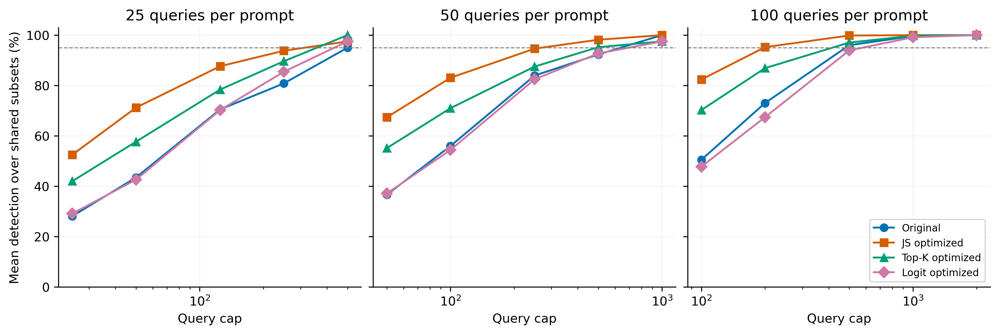
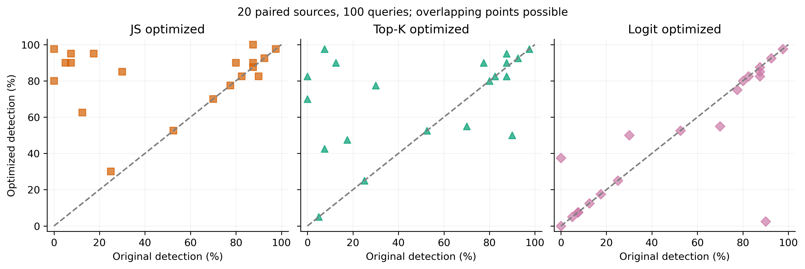

修复来源不一致后，JS代理下的双层优化出现明确的样本内配对改善，Top-K有较弱改善，logit没有普遍改善。这个结论比此前跨来源面板比较更能支持优化收益，但并不等于已证明独立重复下的统计显著性，也不能把收益单独归因于微观或宏观模块。

100次采样时，普通原文的平均单提示词检出率为50.50%，JS为82.375%，提高31.875个百分点；Top-K为70.25%，提高19.75个百分点；logit为47.75%，下降2.75个百分点。均值按20条来源等权计算，每条对应40个攻击端点。800个来源—攻击组合并非800个独立攻击模型。

## 逐来源主分析

| 优化版本 | 查询次数 | 改善/持平/退化（共20来源） | 平均检出率变化（百分点） |
|---|---:|---|---:|
| JS optimized | 25 | 12/6/2 | +24.375 |
| JS optimized | 50 | 13/7/0 | +30.750 |
| JS optimized | 100 | 12/7/1 | +31.875 |
| Top-K optimized | 25 | 11/6/3 | +13.875 |
| Top-K optimized | 50 | 11/7/2 | +18.500 |
| Top-K optimized | 100 | 10/7/3 | +19.750 |
| Logit optimized | 25 | 2/13/5 | +1.000 |
| Logit optimized | 50 | 2/13/5 | +0.500 |
| Logit optimized | 100 | 2/13/5 | -2.750 |

JS并非全部无代价改善：100次时平均单提示词误报率为0.75%，原文为0.25%；Top-K为0.50%，logit为0%。这是来源平均值，不能代替每个面板的误报核查。

## 相同来源面板主分析

在2条×100次的100个共同来源子集中：

| 组别 | 平均检出率 | 平均误报率 | 达到95%标准的子集比例 | 全检出零误报的子集比例 |
|---|---:|---:|---:|---:|
| Original | 73.050% | 0.00% | 23% | 7% |
| JS optimized | 95.225% | 0.00% | 73% | 27% |
| Top-K optimized | 86.900% | 0.85% | 39% | 12% |
| Logit optimized | 67.425% | 0.00% | 13% | 5% |

四组使用完全相同的来源集合。因此JS在这一主分析中的改善不能用“换了一批起始提示词”解释。上述子集比例不是独立模型上的置信度。

## 各组独立排序的补充分析

| 组别 | 95%检出且误报≤5%的最低预算 | 全检出零误报的最低预算 |
|---|---|---|
| Original | 1×100=100；检出39/40，误报0/20 | 5×100=500；检出40/40，误报0/20 |
| JS optimized | 1×100=100；检出39/40，误报0/20 | 2×100=200；检出40/40，误报0/20 |
| Top-K optimized | 2×100=200；检出39/40，误报0/20 | 5×100=500；检出40/40，误报0/20 |
| Logit optimized | 1×100=100；检出39/40，误报0/20 | 2×100=200；检出40/40，误报0/20 |

严格标准下，JS相对普通排序的观测最低查询预算从500降到200，节省60%；对应最少提示词从5条降到2条。但主标准下两组最低预算同为100，不能宣称各可靠性要求下都更省。

logit也能通过筛选得到2×100的严格达标面板，但其逐来源平均表现下降、相同来源随机面板也较弱。这说明“少数好探针可被选出”不等于“优化普遍改善原文”，必须保留两层分析。

## 完整性与适用范围

- 20条共同原文：逻辑、数学、抽取、分类各5条，编号00–04。沿用60份搜索产物，不重新挑选或生成。JS成功14/20，Top-K成功15/20，logit成功7/20；失败保留原文并计入主分析。
- 四组共56条唯一文本；33600条开发响应、336000条正式响应全部在新服务器重采。旧服务器与克隆服务器的正常分布不一致，旧响应未混入。模型权重和主要库版本核验一致，运行时差异原因仍未定位。
- 独立开发攻击用于排名；40个正式攻击端点、20个正常采样面板用于测试。三个查询预算25/50/100，五个面板规模1/2/5/10/20。
- 单来源枚举20个；2/5/10来源各100个固定唯一子集；20来源一个完整子集。配对面板3852条，独立排序面板60条。
- 本地复算50400个提示词判定和全部3912个面板，核验来源对应、回退、排名、种子、全新响应身份、报警及实际查询数，LOCAL_AUDIT.json为PASS。
- 使用既有攻击实例，不是新攻击种子上的确认实验；每强度5种子，正常组是同一模型的20个采样面板。不能将重叠来源子集视为独立重复。
- 优化在旧服务器生成、检测在新服务器完成；这仍是固定候选的同源对照，不是新平台上重新生成算法的重复性验证。
- 当前没有微观/宏观消融，也没有独立证明敏感度分数能预测检测效率。严格达标预算由测试矩阵得到，是探索性最小值。

## 科研判断

当前可以合理提出：在本批同源配对中，JS代理的双层优化提高了普通来源提示词的检测能力与组成小面板的成功率；Top-K增益较小；logit主要依赖少数提示词的选择。下一步应优先冻结JS配置做新种子确认，再进行微观/宏观消融，检验双层设计是否具有不可替代的贡献。不要将这一轮写成所有敏感生成方法都有效。

## 补充：仅接受改写面板（2026-09-23）
已补算排除回退原文的 accepted-only 面板，并与完全相同来源原文配对。详见[仅接受改写面板补充报告](accepted_only/实验结果报告.md)。该补充分析评价成功产物质量，不替代本报告的全来源结果。
