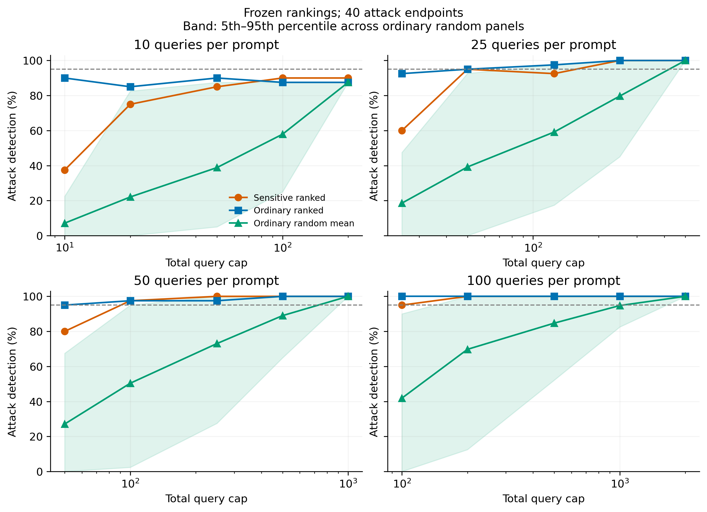
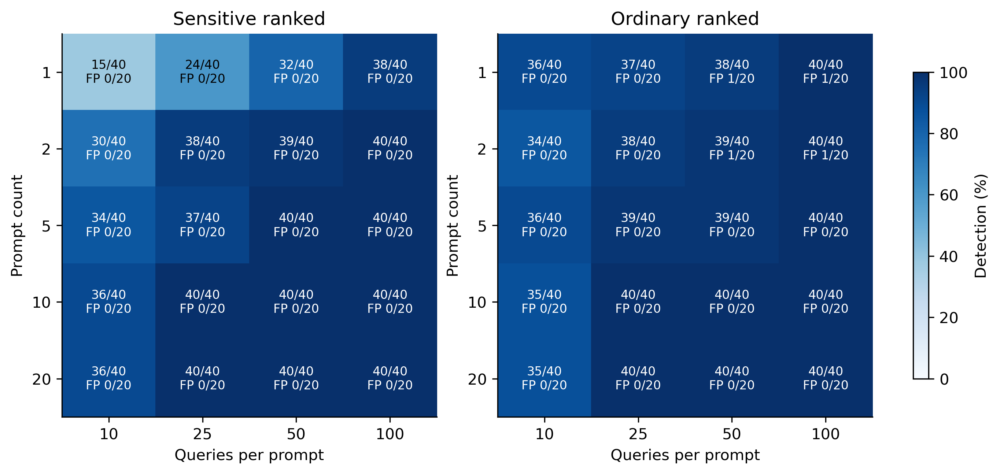

# 敏感提示词预算实验结果（2026-09-20）

## 主要结论

本轮没有证明敏感提示词能够显著降低达到约定可靠性所需的查询预算。经过独立开发集排序后，普通提示词同样可以大幅压缩预算。主标准下两组的最小查询预算均为 50 次；在本批数据要求 100% 检出且零误报时，敏感组预算为 200 次，普通排序组为 250 次，观测上节省 20%，但样本量不足以证明稳定的统计优势。

| 标准 | 方法 | prompt 数 × 每条查询 | 总预算 | 检出 | 误报 |
|---|---|---:|---:|---:|---:|
| 检出≥95%，误报≤5% | Sensitive ranked | 2 × 25 | 50 | 38/40 | 0/20 |
| 检出≥95%，误报≤5% | Ordinary ranked | 1 × 50 | 50 | 38/40 | 1/20 |
| 本批100%检出、零误报 | Sensitive ranked | 2 × 100 | 200 | 40/40 | 0/20 |
| 本批100%检出、零误报 | Ordinary ranked | 10 × 25 | 250 | 40/40 | 0/20 |

普通组还存在 2 条 × 25 次配置，结果同为 38/40 检出、0/20 误报，与敏感组 2 条 × 25 次完全相同。因此即便在主标准上额外要求零误报，也没有最低预算优势。表中普通主标准选择 1 条 × 50 次，是按照预算相同时优先减少 prompt 数的预定规则。

“最少 prompt 数”与“最少预算”不能混为一谈。主标准下两组都可用一条 prompt 达标：普通 1×50、敏感 1×100。严格零误报且全检出时，敏感最少两条（2×100）；普通最少五条（5×100），而普通最低预算配置为10×25。故严格标准下敏感组可减少最少 prompt 数，但不是把普通最少数量从10条降到2条。

旧方案 20×100=2000 次不是本阶段最强基线。两组只需20×25=500次就均达到40/40、0/20；普通排序又可降到250次。不能把敏感200次相对旧2000次的90%下降全部归功于敏感生成算法。

## 实验完整性

- 完成60个双层优化搜索任务，得到36条去重合格候选。搜索任务累计耗时约2.71小时。
- 开发响应33,600条；正式敏感响应120,000条，复用普通响应120,000条。
- 40个攻击端点：两类攻击、每类四强度、每强度五种子。另有20个正常独立采样面板。
- 三类对照覆盖全部20种预算组合；普通随机面板每配置100次重复，共2040条面板配置记录。
- 本地重新验证原始响应身份与种子、开发排名、48000个提示词判定、全部面板命中与实际查询成本；LOCAL_AUDIT.json 为PASS。
- 所有参考分布均核验三档温度下与实际生成分布一致。开发与正式测试攻击种子不重叠，排名在正式敏感响应采集前冻结。

## 分组与稳定性

敏感2×25的两次漏报分别出现在Gaussian 0.001和0.0025（均4/5），其他Gaussian强度与全部LoRA强度均5/5。敏感2×100与普通10×25在八组上均5/5。整体95%并不等于每个攻击强度都达到95%。

普通1×10已检出36/40，敏感1×10仅15/40，说明生成算法及当前排名并未普遍改善低预算单提示词能力。敏感5×50达到40/40、普通5×50为39/40，但单端点差异很小。不能只挑有利预算点宣布有效。

普通随机子集的结果波动较大；在100次固定随机面板中，达到主标准的面板比例至少95%的最小配置为20×25=500次。这说明筛选与排序本身很有价值，生成带来的独立增益应对照普通排序组判断。

## 解释限制

当前最低预算是本批测试矩阵上的探索性最小值，尚未经新一批模型或攻击种子确认。20个正常面板是同一完整模型的不同采样种子；0/20误报也不能保证总体误报低于5%。每强度仅5种子。配对bootstrap仅为逐配置探索性区间，未校正配置选择或多重比较，不能据此宣称总体显著节省预算。

本轮各固定预算只进行一次终点P检验，并逐次执行E检验，双方alpha分配一致；这与上轮30/60/100三次P检验不同，所以应以本轮重算普通组作为公平对照。正常测试面板不用于阈值调优。

主报告的预算为在线查询上限m×n；报警即停的实际查询量保存在每个配置的actual_queries字段中。离线生成、参考分布与开发筛选成本不计入在线预算。敏感生成没有开启语义保持与困惑度硬门槛，文本可能不自然。

## 下一步含义

应把当前结论表述为：敏感提示词在严格全检出、零误报的观测标准下有小幅预算优势，但在预定95%标准下未优于普通排序。若继续验证，应冻结本轮选出的配置，在独立攻击种子与更多正常面板上确认差异；不应直接把本轮结果写成敏感生成算法显著有效。

详细数字见 ranked_budget_results.csv，原始结果见 prompt-budget-v1/BUDGET_RESULTS.json。
