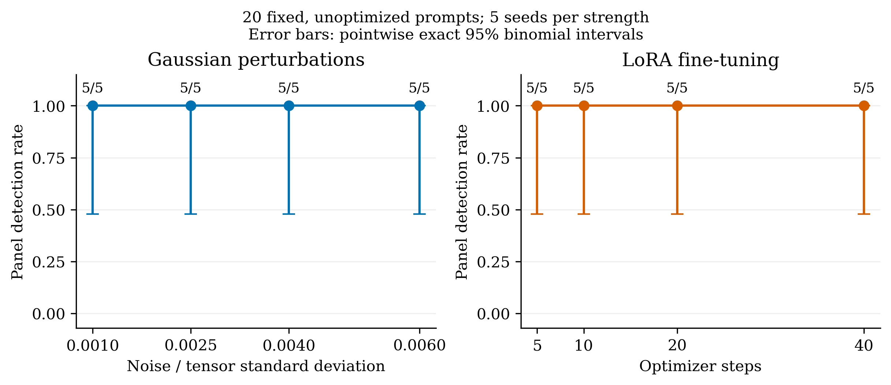
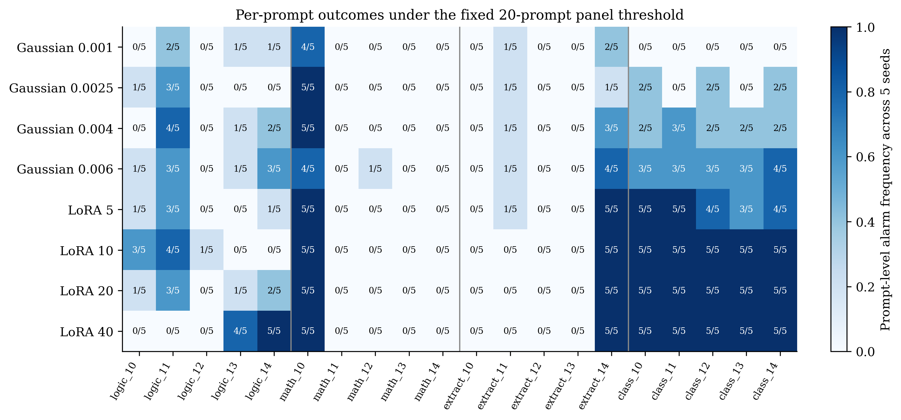
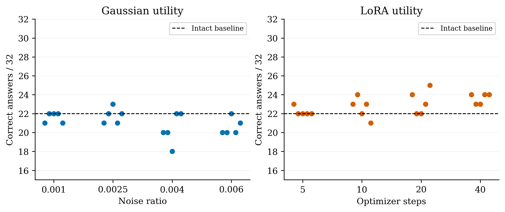

# 四强度 × 五种子矩阵验证结果

已核验 120,000 条首token响应，60个端点，每端点20提示×100次。

|修改|强度|检出端点|检出率|95%区间|
|---|---|---|---|---|
|Gaussian|0.001|5/5|100%|47.8%–100.0%|
|Gaussian|0.0025|5/5|100%|47.8%–100.0%|
|Gaussian|0.004|5/5|100%|47.8%–100.0%|
|Gaussian|0.006|5/5|100%|47.8%–100.0%|
|LoRA|5|5/5|100%|47.8%–100.0%|
|LoRA|10|5/5|100%|47.8%–100.0%|
|LoRA|20|5/5|100%|47.8%–100.0%|
|LoRA|40|5/5|100%|47.8%–100.0%|

LoRA保存的适配器对应的有效更新范数（Frobenius，ΔW=(α/r)BA；未将适配器合并为BF16权重）：

|训练步数|五种子范围|
|---|---|
|5|0.704–0.745|
|10|1.022–1.086|
|20|1.540–1.655|
|40|2.495–2.652|

Gaussian在BF16中的实际变化（所选参数范围）：

|配置强度|实际相对更新范数范围|实际改变参数比例范围|
|---|---|---|
|0.001|0.000869–0.000946|24.0%–24.0%|
|0.0025|0.002376–0.002565|48.5%–48.5%|
|0.004|0.003976–0.004132|62.6%–62.6%|
|0.006|0.005885–0.006297|73.1%–73.1%|

正常面板误报：0/20（0.0%），精确95%区间 0.0%–16.8%。每档只有5个种子，区间是逐档区间，不是整组同时置信界。

## 效用和解释范围

原模型严格效用评分 22/32。效用集沿用上一版32题，只作描述性评估，没有根据效用结果重选攻击。
- gaussian_noise：效用 18–23/32；原模型答对题中丢失 0–4 题。
- finetuning：效用 21–25/32；原模型答对题中丢失 0–2 题。

本轮采用20条固定、未经敏感性优化的普通提示（四类各5条），不是20条新优化敏感提示。它验证该检测器在本轮固定提示集合上的效果；不能据此单独认证双层敏感提示算法，也不能宣称对任意提示和微调数据均泛化。

Gaussian强度是每张选定参数张量标准差的比例；LoRA强度为训练步数，固定rank8/alpha16/学习率1e-4。每档5个不同训练/扰动种子。正常面板是同一模型的20次采样重复，不是20种模型。

检测参考对每条测试提示取得原模型首token概率是本方法的必要步骤，不属于用攻击检测结果选择提示。温度复合null只覆盖{0.5,0.7,0.9}，实际温度0.7，Top-K50、Top-P0.9及默认重复惩罚1.1。结论不能延伸至任意服务端解码配置。

响应续跑保留6个完整面板和第7个面板的200条记录；首版数组/JSONL不一致已修复。中断前未保存的调用数量未知，因此120000指最终保存并核验的检测响应；额外60次参考解码检查、1312次贪心效用调用另计。

CSV中的first_alarm_per_prompt_index是各提示内部最早报警样本下标，不是跨20提示的总查询预算。所有端点实际均采满2000条，未将模拟早停等同实际成本。

最低测试档为Gaussian 0.001及LoRA 5步；即使全部检出，也只能说明这些已测试档位可检出，尚未测定检测极限。所有微调采用同一微型训练集，不能外推到任意LoRA训练任务。

最终强度曲线和检出率以独立核验后的MATRIX_VERIFIED_SUMMARY.json为准；不得将上一轮4条优化提示的6/6结果直接当作本轮结果。
